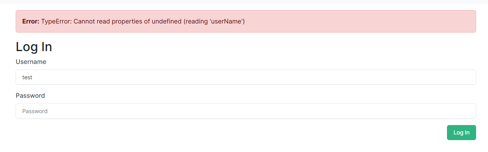

# TODO

- [x] Replace require/export with import/export
- [x] Replace promises with async/await
- [x] Replace lets with consts wherever possible
- [x] Implement CI workflow for linting/testing
- [x] Retreive login history from database instead of cookie
- [x] Bugfix: 
- [ ] Replace bootstrap with tailwind/daisyui
  - [x] Set up tailwind
  - [x] Set up daisyui
  - [ ] Remove bootstrap CDN link and classes (Use this regex to search & replace classes: `/class="[^"]*"/`)
  - [ ] Add `<link>` in main.hbs to `public/css/main.css` instead of `nottailwind.css`
  - [ ] Add component classes to .hbs files
- [ ] Show 5 blog posts at a time on /blog route with pagination to go back/forward
